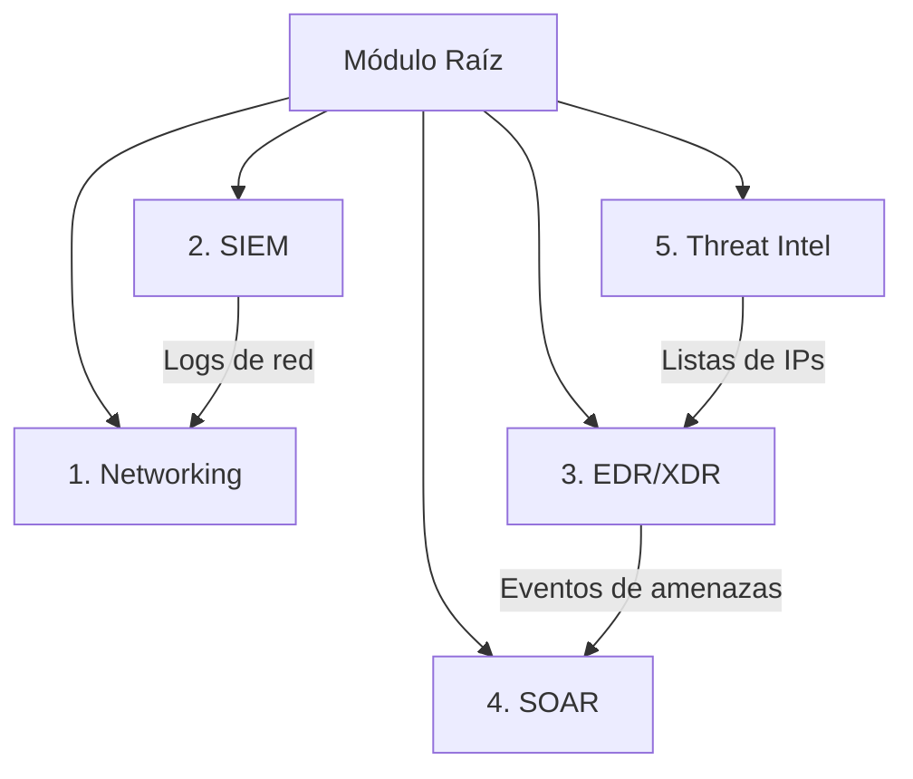

# Centro de Operaciones de Seguridad (SOC) Automatizado en AWS

Este repositorio contiene la arquitectura de infraestructura como código (IaC) en Terraform para el despliegue de un **SOC (Security Operations Center) Automatizado y Optimizado para Free Tier** en Amazon Web Services (AWS). El diseño está enfocado en proporcionar capacidades completas de auditoría, monitoreo, detección de intrusos y respuesta automática ante incidentes con costos mínimos o nulos.

---

## 👥 Presentación del Equipo y Proyecto

Este proyecto fue desarrollado como parte de la materia **Dirección de Proyectos II** en la **Universidad Tecnológica de Aguascalientes**.

* **Institución:** Universidad Tecnológica de Aguascalientes (UTA)
* **Materia:** Dirección de Proyectos II
* **Autores (Alumnos):**
  * **Kevin Antonio Andrade López**
  * **Job Yunior**
  * **Dulce Esmeralda**

---

## 🛠️ Arquitectura Técnica y Módulos

El SOC está compuesto por cinco pilares fundamentales orquestados desde el módulo raíz:



### 1. [Networking](file:///d:/DevOps/SOC%20Ezekiel/modules/networking) (Red Segura)
Establece la infraestructura de red aislada donde operan los recursos.
* **Componentes:** VPC (`10.10.0.0/16`), subred pública (para bastion/sensores) y privada (para cargas de trabajo).
* **Seguridad:** Security Groups específicos, incluyendo uno dedicado a la **Cuarentena/Aislamiento** (`sg-isolation`) para recursos comprometidos.
* **Auditoría:** Habilita **VPC Flow Logs** dirigidos a S3 para auditoría de tráfico de red.

### 2. [SIEM](file:///d:/DevOps/SOC%20Ezekiel/modules/siem) (Monitoreo e Integridad)
Centraliza la recolección, filtrado y alertamiento sobre los eventos de auditoría de la infraestructura.
* **CloudTrail:** Configurado para registrar eventos de gestión a nivel de API de forma gratuita (Single-Region).
* **CloudWatch:** Centraliza los logs con retención de 14 días (ajustada para el Free Tier de 5GB). Cuenta con 7 filtros métricos críticos (ej. intentos de inicio de sesión sin MFA, cambios en Security Groups, acciones del usuario `root`).
* **S3 con Ciclo de Vida:** Los logs se almacenan en S3 y se mueven automáticamente a Glacier a los 30 días para ahorrar costos, destruyéndose a los 90 días.

### 3. [EDR/XDR](file:///d:/DevOps/SOC%20Ezekiel/modules/edr_xdr) (Detección y Postura)
Monitorea continuamente la cuenta y recursos en busca de anomalías y malware.
* **Amazon GuardDuty:** Habilita la detección de amenazas mediante Machine Learning (comportamiento anómalo de APIs, escaneos de puertos, etc.).
* **AWS Security Hub:** Consolida los hallazgos de seguridad y evalúa la postura frente a estándares como el *CIS AWS Foundations Benchmark*.
* **IAM Access Analyzer:** Identifica recursos expuestos públicamente o compartidos fuera de la cuenta.

### 4. [SOAR](file:///d:/DevOps/SOC%20Ezekiel/modules/soar) (Orquestación y Respuesta Automática)
Permite reaccionar a amenazas críticas en cuestión de segundos sin intervención humana.
* **EventBridge:** Captura los hallazgos de GuardDuty y Security Hub.
* **Step Functions (Playbook):** Modela un flujo de respuesta en 6 etapas que incluye el enriquecimiento de la alerta (GeoIP), evaluación de severidad, remediación y notificación.
* **Lambdas en Python:** Una función enriquece los datos de la alerta y otra ejecuta acciones correctivas (bloqueo de IPs de atacantes, aislamiento de red de instancias EC2 y desactivación de credenciales IAM comprometidas).

### 5. [Threat Intel](file:///d:/DevOps/SOC%20Ezekiel/modules/threat_intel) (Inteligencia de Amenazas)
Alimenta a GuardDuty con indicadores de compromiso (IoC) personalizados.
* **IPSets/ThreatIntelSets:** Sincroniza dinámicamente archivos de texto plano almacenados en S3 que contienen listas de direcciones IP conocidas por realizar actividades maliciosas.

---

## 🔒 Buenas Prácticas de Seguridad (Exclusiones para Publicación)

Por motivos de seguridad y para proteger la infraestructura del cliente, **este repositorio no almacena ni expone información sensible**:

> [!WARNING]
> * **Credenciales e Identidades:** Nunca se incluyen claves de acceso (`AWS_ACCESS_KEY_ID`, `AWS_SECRET_ACCESS_KEY`) en el código. Se utilizan roles de IAM con privilegios mínimos y perfiles locales de AWS CLI.
> * **Identificadores Únicos:** El ID de cuenta de AWS real se ha parametrizado mediante variables. El archivo `variables.tf` usa un ID genérico por defecto (`123456789012`).
> * **Archivos de Variables Locales (`.tfvars`):** El archivo real `terraform.tfvars` contiene información específica del cliente (dirección de correo del analista, teléfonos) y está excluido de Git a través de [.gitignore](file:///d:/DevOps/SOC%20Ezekiel/.gitignore). Se proporciona en su lugar [terraform.tfvars.example](file:///d:/DevOps/SOC%20Ezekiel/terraform.tfvars.example) con datos ficticios.
> * **Datos de Eventos:** El CloudTrail está configurado para omitir *Data Events* (lecturas/escrituras individuales de S3 e invocaciones de Lambdas), ya que pueden contener información sensible en los payloads de datos.

---

## 📂 Estructura del Proyecto

* [main.tf](file:///d:/DevOps/SOC%20Ezekiel/main.tf): Orquestador raíz que invoca y conecta todos los módulos del SOC.
* [variables.tf](file:///d:/DevOps/SOC%20Ezekiel/variables.tf): Parámetros de configuración del SOC (regiones, flags para apagar/encender módulos).
* [outputs.tf](file:///d:/DevOps/SOC%20Ezekiel/outputs.tf): Salidas informativas útiles para el cliente (ej. ARN del canal de alertas SNS, consola de Security Hub).
* [docs/manual_usuario.md](file:///d:/DevOps/SOC%20Ezekiel/docs/manual_usuario.md): Guía detallada para el despliegue paso a paso, configuración y simulación de ataques para pruebas del SOC.
* [docs/diagrama_soc.puml](file:///d:/DevOps/SOC%20Ezekiel/docs/diagrama_soc.puml): Diagrama de arquitectura funcional detallado en formato PlantUML.
* [docs/diagrama_codigo.puml](file:///d:/DevOps/SOC%20Ezekiel/docs/diagrama_codigo.puml): Diagrama técnico de la estructura del código Terraform y flujos de variables.

---

## 🚀 Despliegue Rápido (Guía para el Cliente)

### Requisitos Previos
1. Una cuenta activa de AWS (idealmente en Free Tier o tipo Student).
2. Tener configurado el **AWS CLI** localmente.
3. Terraform instalado (versión `>= 1.5.0`).

### Pasos de Despliegue
1. **Clonar el repositorio** y situarse en la raíz del proyecto.
2. **Configurar variables:** Copia la plantilla de ejemplo y edita los valores correspondientes (email, región, ID de cuenta):
   ```bash
   cp terraform.tfvars.example terraform.tfvars
   ```
3. **Inicializar Terraform:**
   ```bash
   terraform init
   ```
4. **Planificar el despliegue:** Valida qué recursos se crearán y asegúrate de que no haya errores:
   ```bash
   terraform plan
   ```
5. **Aplicar los cambios:** Despliega la infraestructura (se solicitará confirmación):
   ```bash
   terraform apply
   ```
   > [!IMPORTANT]
   > Una vez finalizado el despliegue, llegará un correo de confirmación de suscripción de AWS SNS a la dirección configurada en `alert_email`. Es obligatorio abrir dicho correo y hacer clic en **"Confirm subscription"** para empezar a recibir las alertas de seguridad generadas por el SOC.
